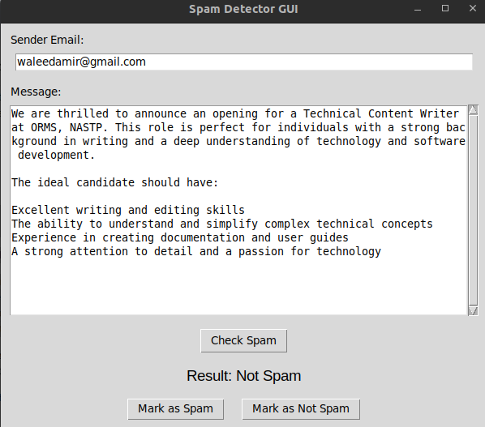

# Spam Message Detector (Trie + Hashing + String Matching)

This project is part of my Data Structures and Algorithms course (CS250) at NUST SEECS. The goal of this project is to detect spam messages using multiple algorithms like Trie, Rabin-Karp String Matching, and Hashing.

## Features:
1. **Trie for Keyword Detection**: A Trie data structure is used to store a set of common spam words (e.g., "win", "lottery", "free") to quickly detect the presence of these words in a message.
2. **Rabin-Karp Algorithm for String Matching**: The Rabin-Karp algorithm is implemented to perform efficient substring searches for spam keywords in email messages.
3. **Spam Detection**: The system uses the above techniques to detect spam messages based on content and sender.
4. **User Feedback System**: If the system is unsure about a message, it asks the user whether they consider it spam and stores this feedback for future reference.
5. **GUI**: Interactive GUI using tkinter allowing the user to view the result and allow user feedback.

## How It Works:

- The system first checks the sender's email against a list of blacklisted senders.
- Then, it checks the message body for suspicious keywords using the Trie structure.
- If the keywords are found, or if the sender is blacklisted, the system classifies the message as "Spam."
- If the system cannot determine if the message is spam, it asks the user for feedback and stores the result for future use.

## Installation:

To run the project, follow these steps:

### 1. **Clone the repository:**

```bash
git clone https://github.com/yourusername/Spam-Message-Detector.git 
```
### 2. **Compile the code:**

```bash
g++ -fPIC -shared DSAproj.cpp -o libspamdetector.so
```
### 3. **Run the program:**

```bash
python DSAprojGUI.py
```

## Files:
- DSAproj.cpp: Main source code for the spam detector.
- DSAprojGUI.py: Frontend using Python
- README.md: Project documentation (this file).


## Example Usage:



## Credits:
Course: Data Structures and Algorithms (CS250)
University: NUST SEECS
